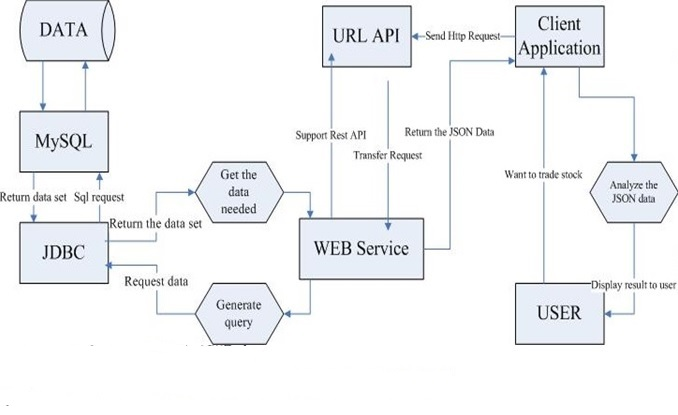
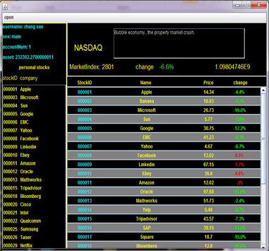
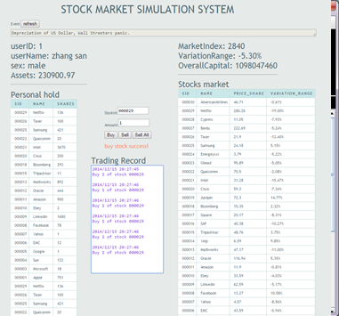
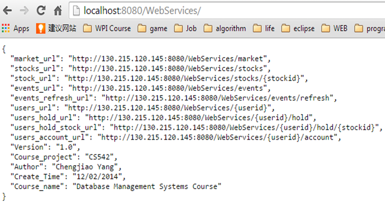

# Stock-Market-All-Stack
The Stock market simulation system project (with desktop/html/andriod/webservice/webapplication stacks)

# Purpose
Build up a more convenient and practical stock market training system avoiding real financial risk;
Make it easier for everyone around the world to access the training system;
Reproduce or duplicate some or all features of a live stock market on a computer basing on database management.

# Design & Docs
For Design & Document, please check:
https://github.com/tedqiao/542project

+ Architecture

# User Interface

+ Desktop Client

+ Html Client

+ Web Service

